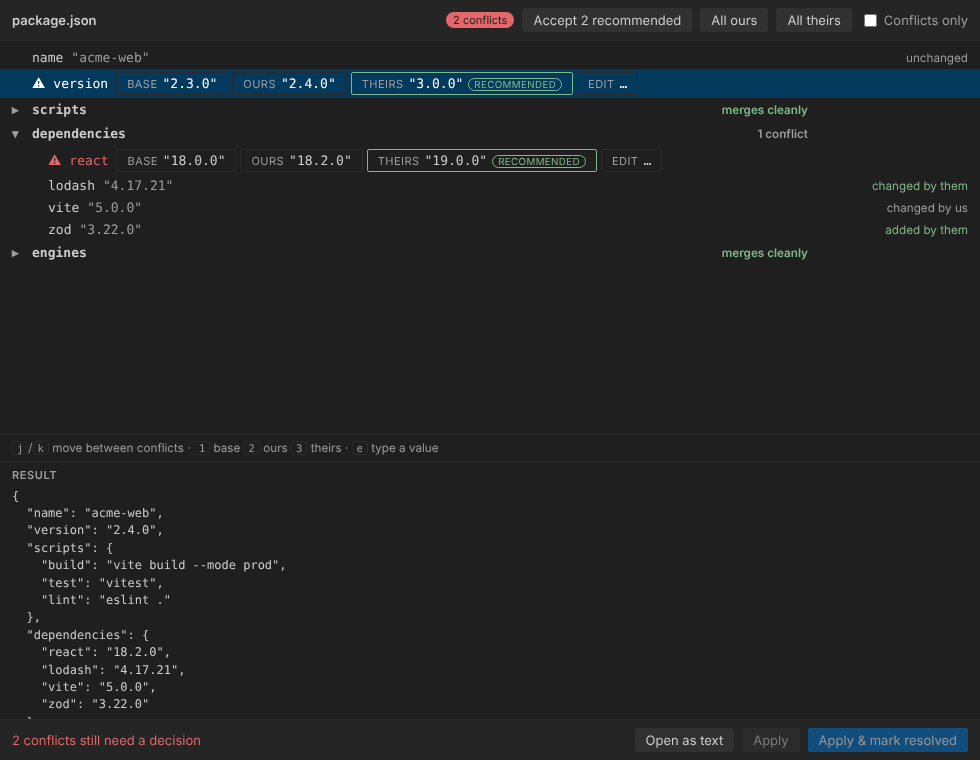

# crispy-octo-rotary-phone

Merging structured files key by key instead of line by line, in two forms:

| | What it is | Use it for |
|---|---|---|
| **[`git-merge-driver`](#the-cli)** | A Python CLI registered as a git merge driver | Merges on the command line and in CI, no editor involved |
| **[Structural Merge Resolver](extension/)** | A VS Code extension | Resolving conflicts interactively, with a UI |

Git's default merge is line-based, so two branches that each add a key to the
same JSON object, or a line to the end of `.gitignore`, conflict even though
the changes are independent. A merge driver lets git hand those files to a
smarter merger; the extension goes further and turns what is left into a set of
choices rather than a file full of conflict markers.



The two share a fixture corpus in [`tests/corpus/`](tests/corpus/) that both test
suites run, so their merge semantics cannot drift apart. Where they differ on
purpose — the extension merges arrays, the CLI keeps them whole — the fixture
states each engine's result rather than hiding it.

---

## The CLI

`git-merge-driver` — a custom [git merge driver](https://git-scm.com/docs/gitattributes#_defining_a_custom_merge_driver)
with pluggable strategies. Pure Python standard library, no dependencies.

## Strategies

| Strategy | Use for | Behavior |
|----------|---------|----------|
| `json`   | `package.json`, config files | Recursive key-by-key 3-way merge. Arrays and scalars are atomic. Real conflicts are reported by JSON path and left with standard conflict markers. Keeps the current branch's indentation and key order. Invalid JSON falls back to a normal text merge. |
| `lines`  | `.gitignore`, `CODEOWNERS`, word lists | Treats the file as a set of lines: additions from both sides are kept, removals from either side applied. Never conflicts. |
| `ours`   | generated files, lockfiles you regenerate | Always keeps the current branch's version. |
| `theirs` | vendored files | Always takes the incoming branch's version. |

## Install

```sh
pip install .            # puts `git-merge-driver` on PATH
```

Or run it without installing: `python3 -m git_merge_driver ...` from this directory.

## Usage

Register a driver in a repository (run inside that repo):

```sh
git-merge-driver install --strategy json '*.json'
git-merge-driver install --strategy lines .gitignore CODEOWNERS
git add .gitattributes && git commit -m "Use custom merge drivers"
```

This writes `merge.<strategy>-merge.driver` to `.git/config` and adds
`<pattern> merge=<strategy>-merge` lines to `.gitattributes`. Options:

- `--name NAME` — driver name (default `<strategy>-merge`)
- `--global` — put the driver definition in `~/.gitconfig` so every repo whose
  `.gitattributes` references it can use it
- `--command CMD` — command git should run (default: `git-merge-driver` if on
  PATH, otherwise this Python interpreter with `-m git_merge_driver`)
- `--attributes-file PATH` — e.g. `.git/info/attributes` to keep it unversioned

Note that `.gitattributes` is committed but `.git/config` is not: everyone who
clones the repo needs to run `install` (or `--global` once) for the driver to
take effect. Without it git silently falls back to its normal merge.

Other commands:

```sh
git-merge-driver strategies          # list strategies
git-merge-driver uninstall json-merge
git-merge-driver merge -s json BASE OURS THEIRS   # what git invokes (%O %A %B)
```

`merge` writes the result into `OURS` and exits `0` when clean, `1` on conflict.

---

## The VS Code extension

See [`extension/`](extension/) for the full description. In short: conflicted
files appear in a **Merge Conflicts** view, and opening one shows the merge as a
tree of decisions — keys that merged cleanly marked as such, keys both branches
changed offered as a choice between ours, theirs, base, or a value you type,
with a live preview of the file that will be written.

It handles JSON/JSONC, YAML, TOML, XML, `.env`, line-set files such as
`.gitignore`, and lockfiles (which it declines to merge entry by entry, for good
reason). Arrays merge as sets or by an identifying field rather than
all-or-nothing, and version conflicts come with the newer side marked
*Recommended*. It is self-contained TypeScript — installing it does not require
Python or this CLI.

```sh
cd extension
npm install && npm run build
```

Press <kbd>F5</kbd> in VS Code to launch it in an Extension Development Host.

---

## Tests

```sh
python3 -m unittest discover -s tests -t .   # the CLI, and the shared corpus
cd extension && npm test                     # the extension engines and git plumbing
cd extension && node dev/shoot.mjs           # the resolver UI, in Chromium
```

The Python integration tests create scratch repositories and run real
`git merge`s through the driver. The extension's git tests do the same against
real conflicted indexes, and `dev/shoot.mjs` drives the real webview against the
real engine in a browser, asserting the interactions and capturing the
screenshots used in this README.
